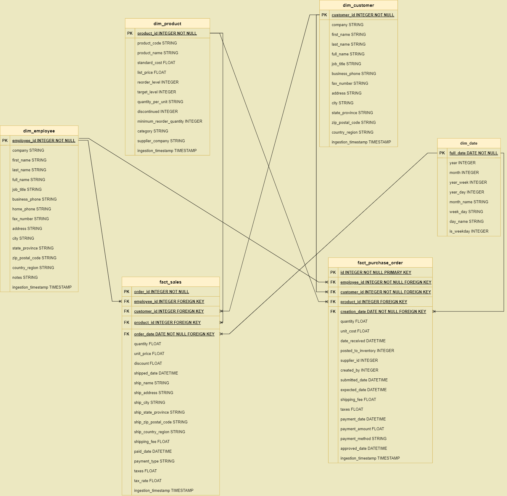

# DBT BIGQUERY DATA ANALYTICS ENGINEERING OF NORTHWIND DATASET
This project is an end-to-end implemntation of building a datawarehouse with bigquery and dbt.
## 📝 Table of Contents
- [ERD](#ERD)
- [Setup & Requirements](#-setup--requirements)
- [Project Recap](#-project-recap)

## ERD

## 🛠 Setup & Requirements
1. **Aws Account**: Ensure you have an active GCP account.
2. **Knowledge required**: Google Bigquery, SQL, DBT

## 🚀 Project Recap
- Raw data is loaded into Bigquery. The staging folder in models folder holds SQL files to load the needed raw data into staging tables. After that,
The data tables in staging layer are transformed and loaded into warehouse layer according to the data modeling shown in Entity Relationship Diagram with
the help of bult-in generic tests in schema.yaml in folder warehouse to ensure data meets the requirements. Finally, One Big Table named obt_import_orders
and obt_sales are created to facilitate the data reporting job.
